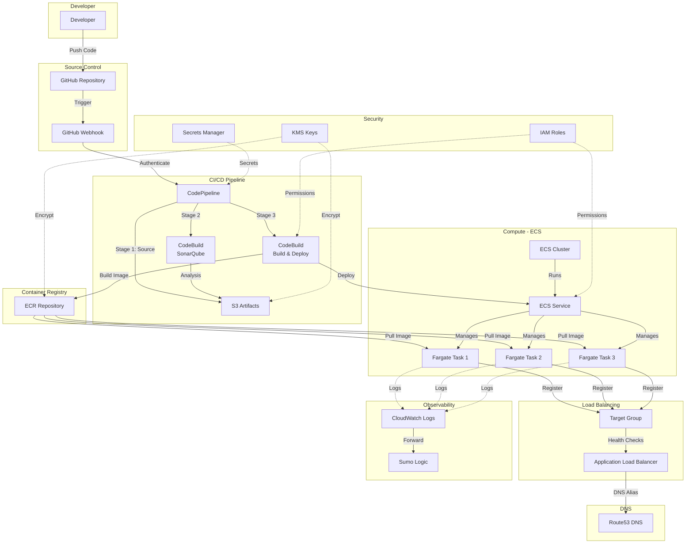

# prodqueriesinfra01 - Architecture Diagrams

## High-Level Architecture Diagram

```
┌─────────────────────────────────────────────────────────────────────────────────┐
│                                  DEVELOPERS                                      │
│                              (Push Code Changes)                                 │
└────────────────────────────────────┬────────────────────────────────────────────┘
                                     │
                                     ▼
┌─────────────────────────────────────────────────────────────────────────────────┐
│                             GITHUB REPOSITORY                                    │
│                          (Source Code Management)                                │
└────────────────────────────────────┬────────────────────────────────────────────┘
                                     │
                                     │ (Webhook Trigger)
                                     ▼
┌─────────────────────────────────────────────────────────────────────────────────┐
│                          CI/CD PIPELINE (CodePipeline)                           │
│                                                                                  │
│  ┌────────────────┐      ┌────────────────┐      ┌─────────────────────┐      │
│  │  Stage 1:      │      │  Stage 2:      │      │  Stage 3:           │      │
│  │  SOURCE        │─────▶│  SONARQUBE     │─────▶│  BUILD & DEPLOY     │      │
│  │                │      │                │      │                     │      │
│  │ • Clone Repo   │      │ • Code Quality │      │ • Build Docker      │      │
│  │ • Get Branch   │      │ • Security Scan│      │ • Push to ECR       │      │
│  │                │      │ • Static Anal. │      │ • Deploy to ECS     │      │
│  └────────────────┘      └────────────────┘      └─────────────────────┘      │
│                                                                                  │
└──────────────────────────────────────┬───────────────────────────────────────────┘
                                       │
                   ┌───────────────────┴──────────────────┐
                   ▼                                      ▼
┌─────────────────────────────────┐    ┌──────────────────────────────────────────┐
│     S3 ARTIFACT STORAGE         │    │     ECR (Container Registry)             │
│                                 │    │                                          │
│  • Pipeline Artifacts           │    │  • Docker Images                         │
│  • KMS Encrypted                │    │  • KMS Encrypted                         │
│  • Versioned                    │    │  • Lifecycle Policies                    │
└─────────────────────────────────┘    └──────────────┬───────────────────────────┘
                                                      │
                                                      │ (Pull Image)
                                                      ▼
┌─────────────────────────────────────────────────────────────────────────────────┐
│                          PRODUCTION ENVIRONMENT                                  │
│                             (AWS us-west-2)                                      │
│                                                                                  │
│  ┌──────────────────────────────────────────────────────────────────────────┐  │
│  │                         VPC (mrad_vpc)                                    │  │
│  │                                                                           │  │
│  │  ┌─────────────────┐  ┌─────────────────┐  ┌─────────────────┐         │  │
│  │  │ AZ 1 (mrad1)    │  │ AZ 2 (mrad2)    │  │ AZ 3 (mrad3)    │         │  │
│  │  │ Private Subnet  │  │ Private Subnet  │  │ Private Subnet  │         │  │
│  │  │                 │  │                 │  │                 │         │  │
│  │  │ ┌─────────────┐ │  │ ┌─────────────┐ │  │ ┌─────────────┐ │         │  │
│  │  │ │  ECS Task   │ │  │ │  ECS Task   │ │  │ │  ECS Task   │ │         │  │
│  │  │ │  (Fargate)  │ │  │ │  (Fargate)  │ │  │ │  (Fargate)  │ │         │  │
│  │  │ │             │ │  │ │             │ │  │ │             │ │         │  │
│  │  │ │ • Container │ │  │ │ • Container │ │  │ │ • Container │ │         │  │
│  │  │ │ • GraphQL   │ │  │ │ • GraphQL   │ │  │ │ • GraphQL   │ │         │  │
│  │  │ └─────────────┘ │  │ └─────────────┘ │  │ └─────────────┘ │         │  │
│  │  └────────┬────────┘  └────────┬────────┘  └────────┬────────┘         │  │
│  │           │                    │                    │                   │  │
│  │           └────────────────────┼────────────────────┘                   │  │
│  │                                │                                        │  │
│  │                                ▼                                        │  │
│  │                 ┌──────────────────────────────────┐                   │  │
│  │                 │  Application Load Balancer (ALB) │                   │  │
│  │                 │                                  │                   │  │
│  │                 │  • Internal (Private)            │                   │  │
│  │                 │  • HTTPS Port 443                │                   │  │
│  │                 │  • TLS Certificate (ACM)         │                   │  │
│  │                 │  • Target Group (HTTP)           │                   │  │
│  │                 │  • Health Checks                 │                   │  │
│  │                 │  • Access Logs → S3              │                   │  │
│  │                 └──────────────┬───────────────────┘                   │  │
│  │                                │                                        │  │
│  └────────────────────────────────┼────────────────────────────────────────┘  │
│                                   │                                           │
└───────────────────────────────────┼───────────────────────────────────────────┘
                                    │
                                    ▼
┌─────────────────────────────────────────────────────────────────────────────────┐
│                          ROUTE53 (DNS SERVICE)                                   │
│                                                                                  │
│  • Private Hosted Zone                                                          │
│  • Alias Record: queries.domain.com → ALB                                      │
│  • Provider: aws.r53                                                            │
└────────────────────────────────────┬────────────────────────────────────────────┘
                                     │
                                     ▼
                              [INTERNAL CLIENTS]
                            (Access via DNS name)


┌─────────────────────────────────────────────────────────────────────────────────┐
│                      OBSERVABILITY & MONITORING                                  │
│                                                                                  │
│  ┌──────────────────────┐          ┌─────────────────────┐                     │
│  │  CloudWatch Logs     │          │   CloudWatch        │                     │
│  │                      │          │   Container         │                     │
│  │  • ECS Task Logs     │──────┐   │   Insights          │                     │
│  │  • CodeBuild Logs    │      │   │                     │                     │
│  │  • Pipeline Logs     │      │   │  • ECS Metrics      │                     │
│  └──────────────────────┘      │   │  • Performance      │                     │
│                                │   └─────────────────────┘                     │
│                                ▼                                                │
│                    ┌──────────────────────┐                                    │
│                    │    SUMO LOGIC        │                                    │
│                    │                      │                                    │
│                    │  • Centralized Logs  │                                    │
│                    │  • Dashboards        │                                    │
│                    │  • Alerts            │                                    │
│                    └──────────────────────┘                                    │
└─────────────────────────────────────────────────────────────────────────────────┘


┌─────────────────────────────────────────────────────────────────────────────────┐
│                      SECURITY & ENCRYPTION                                       │
│                                                                                  │
│  ┌──────────────────────┐    ┌──────────────────────┐    ┌─────────────────┐  │
│  │  AWS Secrets         │    │  KMS Keys            │    │  IAM Roles      │  │
│  │  Manager             │    │                      │    │                 │  │
│  │                      │    │  • Pipeline          │    │  • ECS Exec     │  │
│  │  • GitHub Tokens     │    │  • ECR               │    │  • ECS Task     │  │
│  │  • Webhook Secrets   │    │  • S3 Artifacts      │    │  • CodeBuild    │  │
│  │  • API Keys          │    │                      │    │  • CodePipeline │  │
│  └──────────────────────┘    └──────────────────────┘    └─────────────────┘  │
└─────────────────────────────────────────────────────────────────────────────────┘
```

---

## Detailed Component Architecture

### 1. CI/CD Pipeline Flow

```
┌─────────┐
│ GitHub  │
│   Repo  │
└────┬────┘
     │
     │ Push Event
     │
     ▼
┌─────────────┐
│   Webhook   │◄──────── (HMAC Authentication)
└─────┬───────┘
      │
      ▼
┌──────────────────────────────────────────────────────┐
│         AWS CodePipeline                             │
│                                                      │
│  ┌────────────────────────────────────────────┐    │
│  │ STAGE 1: Source                            │    │
│  │                                            │    │
│  │  Provider: GitHub (ThirdParty)             │    │
│  │  Authentication: OAuth Token (Secrets Mgr) │    │
│  │  Output: source-artifact                   │    │
│  └──────────────────┬─────────────────────────┘    │
│                     │                               │
│                     ▼                               │
│  ┌────────────────────────────────────────────┐    │
│  │ STAGE 2: SonarQube Analysis                │    │
│  │                                            │    │
│  │  Provider: CodeBuild                       │    │
│  │  Project: sonarqube                        │    │
│  │  Compute: BUILD_GENERAL1_LARGE             │    │
│  │  VPC: mrad_vpc (Private Subnets)          │    │
│  │  Checks:                                   │    │
│  │    • Code Quality                          │    │
│  │    • Security Vulnerabilities              │    │
│  │    • Technical Debt                        │    │
│  │  Input: source-artifact                    │    │
│  │  Output: sonarqube-artifact                │    │
│  └──────────────────┬─────────────────────────┘    │
│                     │                               │
│                     ▼                               │
│  ┌────────────────────────────────────────────┐    │
│  │ STAGE 3: Build & Deploy                    │    │
│  │                                            │    │
│  │  Provider: CodeBuild                       │    │
│  │  Project: build                            │    │
│  │  Compute: BUILD_GENERAL1_LARGE             │    │
│  │  VPC: mrad_vpc (Private Subnets)          │    │
│  │  Privileged: true (Docker build)           │    │
│  │  Environment: aws/codebuild/standard:7.0   │    │
│  │                                            │    │
│  │  Steps:                                    │    │
│  │    1. Build Docker image                   │    │
│  │    2. Tag with git commit hash             │    │
│  │    3. Push to ECR repository               │    │
│  │    4. Update ECS task definition           │    │
│  │    5. Deploy to ECS service                │    │
│  │                                            │    │
│  │  Input: build-artifact                     │    │
│  │  Output: build-artifact                    │    │
│  └──────────────────┬─────────────────────────┘    │
│                     │                               │
└─────────────────────┼───────────────────────────────┘
                      │
          ┌───────────┴──────────┐
          ▼                      ▼
    ┌──────────┐          ┌──────────┐
    │    S3    │          │   ECR    │
    │ Artifacts│          │  Images  │
    └──────────┘          └────┬─────┘
                               │
                               ▼
                          [ECS Deploy]
```

---

### 2. Runtime Infrastructure (ECS Service)

```
                          [Route53 DNS]
                     queries.domain.com
                               │
                               ▼
              ┌────────────────────────────────┐
              │  Application Load Balancer     │
              │                                │
              │  Listener:                     │
              │    Port: 443 (HTTPS)           │
              │    Protocol: HTTPS             │
              │    SSL Policy: TLS13-1-2-2021  │
              │    Certificate: ACM            │
              │                                │
              │  Target Group:                 │
              │    Port: var.application_port  │
              │    Protocol: HTTP              │
              │    Target Type: IP             │
              │    Health Check: /health       │
              │    Matcher: 404-499            │
              └────────┬───────────────────────┘
                       │
                       │ (Routes to targets)
                       │
       ┌───────────────┼───────────────┐
       │               │               │
       ▼               ▼               ▼
┌────────────┐  ┌────────────┐  ┌────────────┐
│  Subnet 1  │  │  Subnet 2  │  │  Subnet 3  │
│  (mrad1)   │  │  (mrad2)   │  │  (mrad3)   │
│  AZ-1      │  │  AZ-2      │  │  AZ-3      │
│            │  │            │  │            │
│ ┌────────┐ │  │ ┌────────┐ │  │ ┌────────┐ │
│ │ECS Task│ │  │ │ECS Task│ │  │ │ECS Task│ │
│ │Fargate │ │  │ │Fargate │ │  │ │Fargate │ │
│ │        │ │  │ │        │ │  │ │        │ │
│ │Container│ │  │ │Container│ │  │ │Container│ │
│ │  from  │ │  │ │  from  │ │  │ │  from  │ │
│ │  ECR   │ │  │ │  ECR   │ │  │ │  ECR   │ │
│ │        │ │  │ │        │ │  │ │        │ │
│ │ Port:  │ │  │ │ Port:  │ │  │ │ Port:  │ │
│ │  app   │ │  │ │  app   │ │  │ │  app   │ │
│ └───┬────┘ │  │ └───┬────┘ │  │ └───┬────┘ │
│     │      │  │     │      │  │     │      │
│     │Logs  │  │     │Logs  │  │     │Logs  │
│     ▼      │  │     ▼      │  │     ▼      │
└────────────┘  └────────────┘  └────────────┘
       │               │               │
       └───────────────┼───────────────┘
                       ▼
              ┌─────────────────┐
              │ CloudWatch Logs │
              │                 │
              │ Log Group:      │
              │ /aws/queries    │
              └────────┬────────┘
                       │
                       ▼
              ┌─────────────────┐
              │   Sumo Logic    │
              │  (Aggregation)  │
              └─────────────────┘


┌─────────────────────────────────────────────┐
│           ECS Service Details               │
│                                             │
│  Cluster: ecs_cluster                       │
│  Launch Type: FARGATE                       │
│  Network Mode: awsvpc                       │
│  Desired Count: var.task_count              │
│  Platform: LATEST                           │
│                                             │
│  Task Definition:                           │
│    CPU: var.task_cpu                        │
│    Memory: var.task_memory                  │
│    Execution Role: ecs_exe_role             │
│    Task Role: ecs_task_role                 │
│    Requires: FARGATE                        │
│                                             │
│  Network Config:                            │
│    Subnets: [private1, private2, private3]  │
│    Security Groups: [ecs_security_group]    │
│    Assign Public IP: false                  │
│                                             │
│  Load Balancer Config:                      │
│    Target Group: alb_target_group           │
│    Container Name: queries-container        │
│    Container Port: var.application_port     │
└─────────────────────────────────────────────┘
```

---

### 3. Network Architecture

```
┌──────────────────────────────────────────────────────────────────┐
│                      AWS Region: us-west-2                        │
│                                                                   │
│  ┌────────────────────────────────────────────────────────────┐ │
│  │                    VPC (mrad_vpc)                          │ │
│  │                   CIDR: [VPC Range]                        │ │
│  │                                                            │ │
│  │  ┌──────────────────────────────────────────────────────┐ │ │
│  │  │          Availability Zone 1 (us-west-2a)            │ │ │
│  │  │                                                      │ │ │
│  │  │  ┌────────────────────────────────┐                 │ │ │
│  │  │  │  Private Subnet (mrad1)        │                 │ │ │
│  │  │  │                                │                 │ │ │
│  │  │  │  • ECS Task (Fargate)          │                 │ │ │
│  │  │  │  • CodeBuild                   │                 │ │ │
│  │  │  │  • ALB Target                  │                 │ │ │
│  │  │  │                                │                 │ │ │
│  │  │  │  Security Groups:              │                 │ │ │
│  │  │  │    - ecs_security_group        │                 │ │ │
│  │  │  │    - lambda_sgs                │                 │ │ │
│  │  │  └────────────────────────────────┘                 │ │ │
│  │  └──────────────────────────────────────────────────────┘ │ │
│  │                                                            │ │
│  │  ┌──────────────────────────────────────────────────────┐ │ │
│  │  │          Availability Zone 2 (us-west-2b)            │ │ │
│  │  │                                                      │ │ │
│  │  │  ┌────────────────────────────────┐                 │ │ │
│  │  │  │  Private Subnet (mrad2)        │                 │ │ │
│  │  │  │                                │                 │ │ │
│  │  │  │  • ECS Task (Fargate)          │                 │ │ │
│  │  │  │  • CodeBuild                   │                 │ │ │
│  │  │  │  • ALB Target                  │                 │ │ │
│  │  │  │                                │                 │ │ │
│  │  │  │  Security Groups:              │                 │ │ │
│  │  │  │    - ecs_security_group        │                 │ │ │
│  │  │  │    - lambda_sgs                │                 │ │ │
│  │  │  └────────────────────────────────┘                 │ │ │
│  │  └──────────────────────────────────────────────────────┘ │ │
│  │                                                            │ │
│  │  ┌──────────────────────────────────────────────────────┐ │ │
│  │  │          Availability Zone 3 (us-west-2c)            │ │ │
│  │  │                                                      │ │ │
│  │  │  ┌────────────────────────────────┐                 │ │ │
│  │  │  │  Private Subnet (mrad3)        │                 │ │ │
│  │  │  │                                │                 │ │ │
│  │  │  │  • ECS Task (Fargate)          │                 │ │ │
│  │  │  │  • CodeBuild                   │                 │ │ │
│  │  │  │  • ALB Target                  │                 │ │ │
│  │  │  │                                │                 │ │ │
│  │  │  │  Security Groups:              │                 │ │ │
│  │  │  │    - ecs_security_group        │                 │ │ │
│  │  │  │    - lambda_sgs                │                 │ │ │
│  │  │  └────────────────────────────────┘                 │ │ │
│  │  └──────────────────────────────────────────────────────┘ │ │
│  │                                                            │ │
│  │  ┌──────────────────────────────────────────────────────┐ │ │
│  │  │        Application Load Balancer                     │ │ │
│  │  │        (Spans all 3 AZs)                             │ │ │
│  │  │                                                      │ │ │
│  │  │  • Internal                                          │ │ │
│  │  │  • Scheme: internal                                  │ │ │
│  │  │  • Type: application                                 │ │ │
│  │  │  • IP Address Type: ipv4                             │ │ │
│  │  └──────────────────────────────────────────────────────┘ │ │
│  │                                                            │ │
│  └────────────────────────────────────────────────────────────┘ │
└──────────────────────────────────────────────────────────────────┘
```

---

### 4. Security Architecture

```
┌─────────────────────────────────────────────────────────────────┐
│                    IAM Roles & Permissions                       │
│                                                                  │
│  ┌──────────────────┐    ┌──────────────────┐                  │
│  │ ECS Execution    │    │  ECS Task Role   │                  │
│  │     Role         │    │                  │                  │
│  │                  │    │                  │                  │
│  │ Permissions:     │    │ Permissions:     │                  │
│  │ • Pull ECR       │    │ • App-specific   │                  │
│  │ • Write CloudW.  │    │ • DynamoDB       │                  │
│  │ • Decrypt KMS    │    │ • S3 Access      │                  │
│  │ • Read Secrets   │    │ • Other AWS APIs │                  │
│  └──────────────────┘    └──────────────────┘                  │
│                                                                  │
│  ┌──────────────────┐    ┌──────────────────┐                  │
│  │ CodeBuild Role   │    │ CodePipeline     │                  │
│  │                  │    │     Role         │                  │
│  │                  │    │                  │                  │
│  │ Permissions:     │    │ Permissions:     │                  │
│  │ • Build Image    │    │ • S3 Artifacts   │                  │
│  │ • Push ECR       │    │ • CodeBuild      │                  │
│  │ • Deploy ECS     │    │ • GitHub Webhook │                  │
│  │ • VPC Access     │    │ • Decrypt KMS    │                  │
│  │ • CloudWatch     │    │ • Read Secrets   │                  │
│  └──────────────────┘    └──────────────────┘                  │
└─────────────────────────────────────────────────────────────────┘

┌─────────────────────────────────────────────────────────────────┐
│                    KMS Encryption Keys                           │
│                                                                  │
│  ┌──────────────────┐    ┌──────────────────┐                  │
│  │ Pipeline KMS     │    │  ECR KMS Key     │                  │
│  │     Key          │    │                  │                  │
│  │                  │    │                  │                  │
│  │ Encrypts:        │    │ Encrypts:        │                  │
│  │ • S3 Artifacts   │    │ • Docker Images  │                  │
│  │ • Pipeline Data  │    │ • Repository     │                  │
│  └──────────────────┘    └──────────────────┘                  │
└─────────────────────────────────────────────────────────────────┘

┌─────────────────────────────────────────────────────────────────┐
│                  AWS Secrets Manager                             │
│                                                                  │
│  • github_token (OAuth for GitHub access)                       │
│  • tf_arbitrary_secret (Webhook HMAC secret)                    │
│                                                                  │
│  Access Patterns:                                               │
│    - CodePipeline reads during Source stage                     │
│    - Webhook uses for authentication                            │
│    - Encrypted at rest                                          │
│    - IAM-controlled access                                      │
└─────────────────────────────────────────────────────────────────┘

┌─────────────────────────────────────────────────────────────────┐
│                    Security Groups                               │
│                                                                  │
│  ┌──────────────────────────────────────────┐                  │
│  │  ecs_security_group                      │                  │
│  │                                          │                  │
│  │  Inbound:                                │                  │
│  │    • Port: application_port              │                  │
│  │    • Source: ALB security group          │                  │
│  │    • Protocol: TCP                       │                  │
│  │                                          │                  │
│  │  Outbound:                               │                  │
│  │    • All traffic (for ECR, CloudWatch)   │                  │
│  └──────────────────────────────────────────┘                  │
│                                                                  │
│  ┌──────────────────────────────────────────┐                  │
│  │  lambda_sgs (Used by CodeBuild)          │                  │
│  │                                          │                  │
│  │  Inbound:                                │                  │
│  │    • [CodeBuild-specific rules]          │                  │
│  │                                          │                  │
│  │  Outbound:                               │                  │
│  │    • All traffic                         │                  │
│  └──────────────────────────────────────────┘                  │
└─────────────────────────────────────────────────────────────────┘
```

---

### 5. Data Flow Diagram

```
┌──────────────┐
│   DEVELOPER  │
└──────┬───────┘
       │
       │ git push
       │
       ▼
┌─────────────────┐
│ GitHub Repo     │
│ (Source Code)   │
└────────┬────────┘
         │
         │ Webhook Trigger
         │
         ▼
┌──────────────────────────────────┐
│      CodePipeline Webhook        │
│      (HMAC Authentication)       │
└────────┬─────────────────────────┘
         │
         ▼
┌──────────────────────────────────┐
│   CodePipeline: Source Stage     │
│   • Clone repository             │
│   • Extract source code          │
└────────┬─────────────────────────┘
         │
         │ Source Artifact
         │
         ▼
┌──────────────────────────────────┐
│         S3 Bucket                │
│   (Pipeline Artifacts)           │
│   • Encrypted with KMS           │
└────────┬─────────────────────────┘
         │
         │ Retrieve Artifact
         │
         ▼
┌──────────────────────────────────┐
│  CodeBuild: SonarQube Analysis   │
│  • Static code analysis          │
│  • Security scanning             │
│  • Quality gates                 │
└────────┬─────────────────────────┘
         │
         │ Analysis Results
         │
         ▼
┌──────────────────────────────────┐
│     CodeBuild: Build Stage       │
│     • npm install                │
│     • docker build               │
│     • docker tag                 │
└────────┬─────────────────────────┘
         │
         │ Docker Image
         │
         ▼
┌──────────────────────────────────┐
│      ECR Repository              │
│      • Store Docker image        │
│      • Encrypted with KMS        │
│      • Tagged with git hash      │
└────────┬─────────────────────────┘
         │
         │ docker push
         │
         ▼
┌──────────────────────────────────┐
│   CodeBuild: Deploy Stage        │
│   • Update ECS task definition   │
│   • Update ECS service           │
│   • Trigger service update       │
└────────┬─────────────────────────┘
         │
         │ Deployment
         │
         ▼
┌──────────────────────────────────┐
│       ECS Service                │
│       • Pull new image from ECR  │
│       • Stop old tasks           │
│       • Start new tasks          │
└────────┬─────────────────────────┘
         │
         │ Container Running
         │
         ▼
┌──────────────────────────────────┐
│      Fargate Tasks               │
│      • Container executes        │
│      • App listens on port       │
│      • Health checks pass        │
└────────┬─────────────────────────┘
         │
         │ Register with ALB
         │
         ▼
┌──────────────────────────────────┐
│   ALB Target Group               │
│   • Health checks                │
│   • Add to target pool           │
│   • Ready for traffic            │
└────────┬─────────────────────────┘
         │
         │ Route Traffic
         │
         ▼
┌──────────────────────────────────┐
│   Application Load Balancer      │
│   • Receive HTTPS requests       │
│   • TLS termination              │
│   • Route to healthy targets     │
└────────┬─────────────────────────┘
         │
         │ DNS Resolution
         │
         ▼
┌──────────────────────────────────┐
│       Route53 DNS                │
│       • queries.domain.com       │
│       • Points to ALB            │
└────────┬─────────────────────────┘
         │
         │
         ▼
┌──────────────────────────────────┐
│      INTERNAL CLIENTS            │
│      • Access application        │
│      • GraphQL requests          │
└──────────────────────────────────┘


  ┌──────────────────────────────┐
  │     OBSERVABILITY FLOW       │
  │                              │
  │  ECS Tasks                   │
  │     │                        │
  │     │ stdout/stderr          │
  │     ▼                        │
  │  CloudWatch Logs             │
  │     │                        │
  │     │ Lambda Forwarder       │
  │     ▼                        │
  │  Sumo Logic                  │
  │     │                        │
  │     ▼                        │
  │  Dashboards & Alerts         │
  └──────────────────────────────┘
```

---

## Resource Dependency Map

```
github_repository
    │
    └─► github_repository_webhook
            │
            └─► aws_codepipeline_webhook
                    │
                    └─► aws_codepipeline.pipeline
                            │
                            ├─► module.pipeline_bucket (S3)
                            │       │
                            │       └─► data.aws_kms_key.pipeline
                            │
                            ├─► module.sonarqube (CodeBuild)
                            │       │
                            │       ├─► data.aws_iam_role.build
                            │       ├─► data.aws_vpc.mrad_vpc
                            │       └─► data.aws_subnet.[mrad1,mrad2,mrad3]
                            │
                            └─► aws_codebuild_project.build
                                    │
                                    ├─► data.aws_iam_role.build
                                    ├─► data.aws_kms_key.pipeline
                                    └─► aws_ecr_repository.ecr_repository
                                            │
                                            ├─► data.aws_kms_key.ecr
                                            └─► aws_ecr_lifecycle_policy
                                                    │
                                                    └─► aws_ecs_task_definition.ecs_task
                                                            │
                                                            ├─► module.queries_logs (CloudWatch)
                                                            │       │
                                                            │       └─► module.queries_sumo
                                                            │
                                                            ├─► data.aws_iam_role.ecs_exe_role
                                                            ├─► data.aws_iam_role.ecs_task_role
                                                            │
                                                            └─► aws_ecs_service.ecs_service
                                                                    │
                                                                    ├─► aws_ecs_cluster.ecs_cluster
                                                                    ├─► data.aws_subnet.[private1,private2,private3]
                                                                    ├─► data.aws_security_group.ecs_security_group
                                                                    │
                                                                    └─► aws_lb_target_group.alb_target_group
                                                                            │
                                                                            ├─► data.aws_vpc.mrad_vpc
                                                                            ├─► random_string.target_group_suffix
                                                                            │
                                                                            └─► aws_lb_listener.alb_listener
                                                                                    │
                                                                                    ├─► aws_lb.load_balancer
                                                                                    │       │
                                                                                    │       ├─► module.lb_log_bucket (S3)
                                                                                    │       └─► data.aws_security_group.ecs_security_group
                                                                                    │
                                                                                    └─► module.queries_lb_cert (ACM)
                                                                                            │
                                                                                            └─► aws_route53_record.service_dns
                                                                                                    │
                                                                                                    └─► data.aws_route53_zone.private_zone
```

---

## Mermaid Diagram (For Documentation Tools)



---

## Summary

This architecture implements a **fully automated, highly available, and secure containerized application platform** with the following key characteristics:

1. **Automated CI/CD**: Every code change triggers automated build, test, and deployment
2. **High Availability**: Multi-AZ deployment across 3 availability zones
3. **Serverless**: No infrastructure management with Fargate
4. **Secure**: Encryption at rest and in transit, private networking, IAM roles
5. **Observable**: Comprehensive logging and monitoring
6. **Scalable**: Auto-scaling capability through ECS

The infrastructure is production-ready and follows AWS best practices for security, reliability, and operational excellence.

